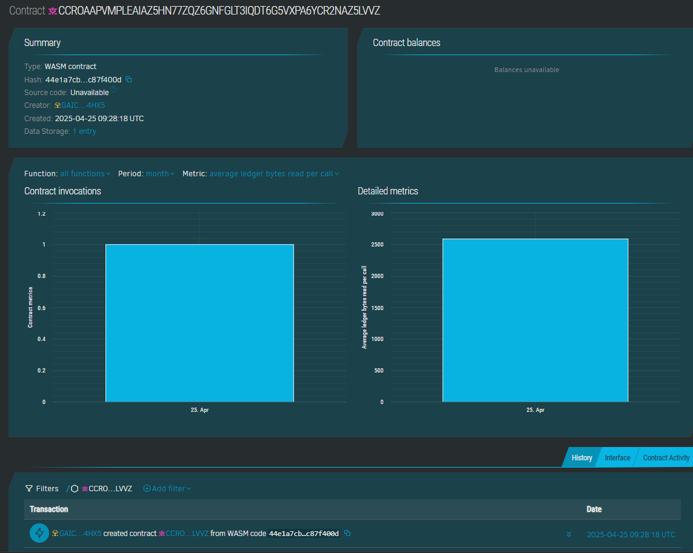

# Customizable Gift Boxes

## Project Description
A smart contract solution that allows users to create and customize digital gift boxes on the blockchain. Each gift box contains a message or item description and can be updated before it's finalized for delivery.

## Project Vision
To make gifting more interactive and decentralized by enabling users to send personalized digital gift experiences using blockchain technology.

## Key Features
- **Create Gift Box**: Users can create a new gift box with default content.
- **Customize Gift Box**: Box owners can edit and personalize the contents before it's marked as finalized.
- **View Gift Box**: Anyone can view the contents and customization status of a gift box by its ID.

## Future Scope
- Add recipient functionality with secure claim mechanism.
- Allow multimedia content (like images or voice notes) via IPFS.
- Implement token-based gifting and NFT-wrapped gifts.
- Include expiration logic and access control for opening boxes.

## contractID-
CCROAAPVMPLEAIAZ5HN77ZQZ6GNFGLT3IQDTGG5VXPA6YCR2NAZ5LWVZ

